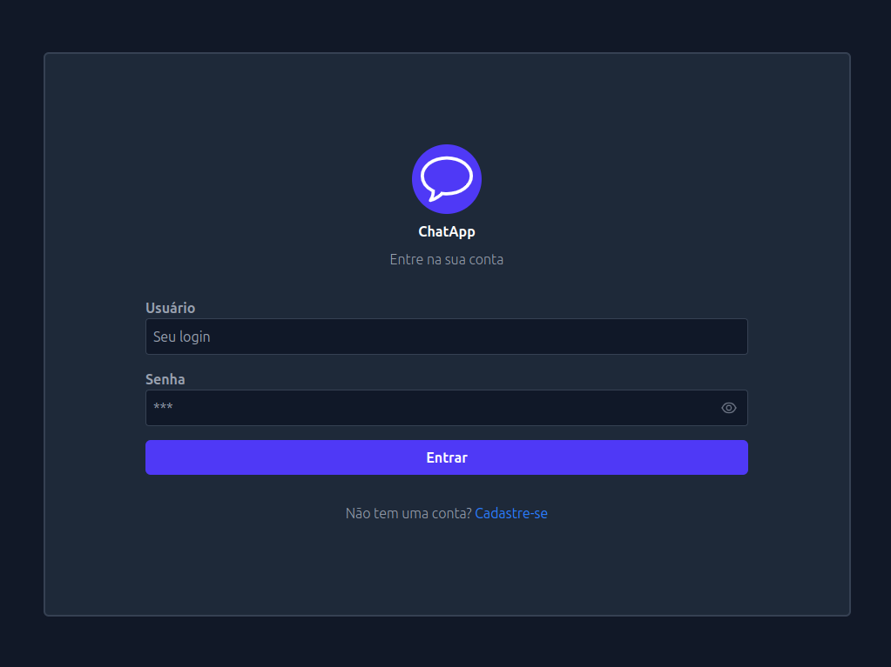
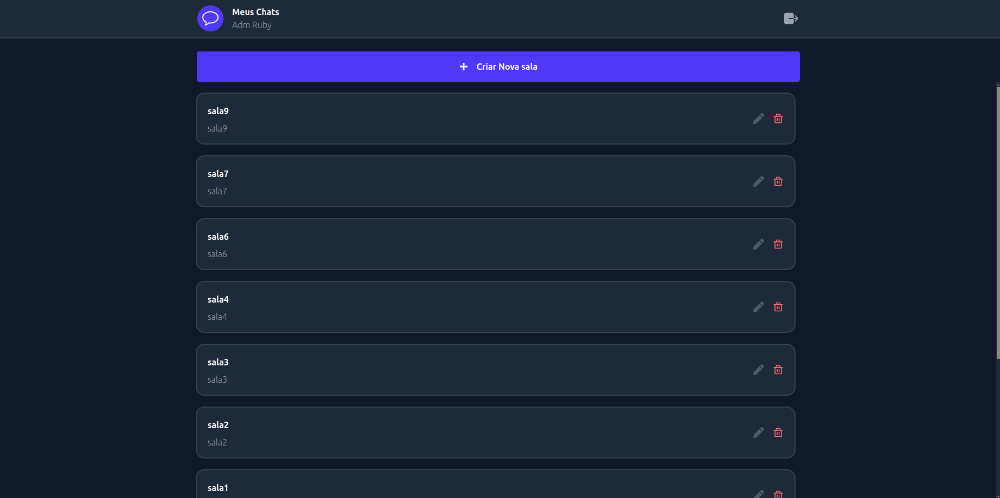
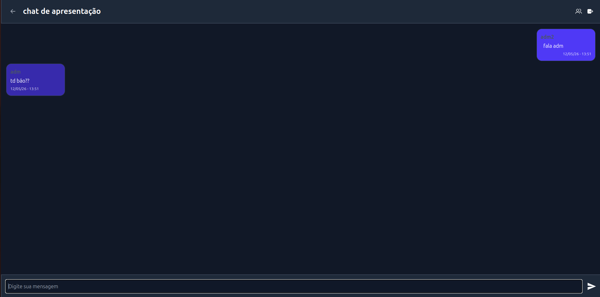

# 💬 React Real Time Chat

<p align="center">
  Aplicação de chat em tempo real desenvolvida com React, focada em comunicação instantânea, atualização dinâmica e experiência fluida para múltiplos usuários.
</p>

---

## 📌 Sobre o projeto

O **React Real Time Chat** é uma aplicação front-end construída para simular uma experiência moderna de troca de mensagens em tempo real.

O sistema permite autenticação, navegação entre salas e atualização instantânea de mensagens sem necessidade de recarregar a página, aplicando conceitos fundamentais de arquitetura front-end, componentização e gerenciamento reativo de estado.

---

## ✨ Funcionalidades

### 🔐 Autenticação
- Login de usuário
- Separação entre área pública e privada

### 💬 Chat em tempo real
- Listagem de salas disponíveis
- Entrada em salas específicas
- Envio de mensagens instantâneas
- Atualização automática sem reload

### 👤 Identificação de usuários
- Exibição do usuário autenticado
- Identificação do autor em cada mensagem

### ⚡ Performance e usabilidade
- Infinite scroll para:
  - Salas
  - Usuários
  - Histórico de mensagens
- Renderização dinâmica
- Feedback visual com toast notifications
- Validação para impedir envio de mensagens vazias

---

## 🏗️ Arquitetura

O projeto foi estruturado com foco em escalabilidade, organização e separação de responsabilidades.

### Componentização

Separação em módulos independentes:

```txt
src/
 ├── components
 ├── pages
 ├── hooks
 ├── services
 ├── routes
 └── utils
```

---

### Renderização reativa

A interface responde automaticamente às alterações de estado e aos eventos em tempo real, garantindo sincronização entre usuários conectados.

---

### Performance

A implementação de **infinite scroll** reduz carregamento inicial e melhora a navegação em listas extensas.

---

### Navegação

Fluxo dividido entre:

- Área pública (login)
- Área privada (chat)

---

## 🛠️ Tecnologias utilizadas

- **React**
- **JavaScript / TypeScript**
- **React Hooks**
- **WebSocket**
- **React Router**
- **Toast Notifications**

---

## 🚀 Como executar

### Clone o repositório

```bash
git clone git@github.com:anasouza0087/react-real-time-chat.git
```

### Acesse a pasta

```bash
cd react-real-time-chat
```

### Instale as dependências

```bash
npm install
```

### Execute o projeto

```bash
npm run dev
```

---

## 📷 Preview

### Tela de Login



---

### Lista de Salas



---

### Chat em Tempo Real



---

## 🧠 Principais desafios

Durante o desenvolvimento, os principais desafios foram:

- Sincronização de mensagens em tempo real
- Atualização dinâmica da interface
- Controle eficiente de renderização
- Implementação de scroll infinito
- Organização da arquitetura front-end

---

## 📚 Aprendizados

Este projeto permitiu aprofundar conhecimentos em:

- Comunicação em tempo real no front-end
- Gerenciamento de estado
- Arquitetura escalável em React
- Otimização de renderização
- Estruturação de aplicações interativas

---

## 👩‍💻 Autora

**Ana Bezerra**

Frontend Developer

📫 Contato: **anabezerra.dev@gmail.com**